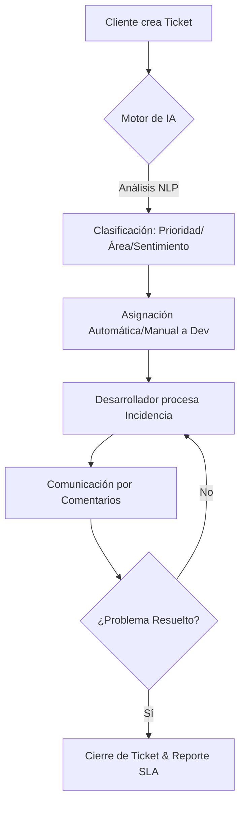

# 🏢 Sistema de Soporte y Gestión de Portales (Canal de Comunicación con Clientes)

## 📋 Descripción General del Proyecto
Esta plataforma es un canal centralizado diseñado para que los clientes de **Suttaq** reciban soporte sobre los sistemas y páginas web desarrollados por nuestra empresa. Permite unificar la comunicación de errores, monitorear el rendimiento de los portales entregados y automatizar el triaje mediante Inteligencia Artificial para dar respuesta prioritaria a fallos críticos.

---

## 🏗️ Arquitectura y Stack Tecnológico

| Capa | Tecnología | Propósito |
|---|---|---|

---

## 🔄 Flujo Operativo del Sistema



1. **Ingreso**: El cliente reporta un problema indicando el portal afectado.
2. **Procesamiento Asíncrono**: El sistema envía el texto al microservicio de IA.
3. **Triaje Automatizado**: Se actualizan los metadatos en la base de datos (Prioridad AI, Área AI).
4. **Gestión**: El personal técnico recibe alertas y comienza la resolución.
5. **Cierre**: Tras la resolución, el sistema genera métricas automáticas para reportes semanales.

---

## 📂 Organización del Código

* `/app`: Rutas y lógica de páginas de Next.js.
* `/components`: Componentes de UI modulares (Dashboard, UI Elements).
* `/lib`: Utilidades, tipos de datos y cliente de Prisma.
* `/prisma`: Esquema de la base de datos y migraciones.
* `/hook`: Hooks personalizados para estado y notificaciones.

---

## 🚀 Instalación y Configuración

1. **Clonar el repositorio:**

    ```bash
    git clone [url-del-repo]
    ```

2. **Instalar dependencias:**

    ```bash
    npm install
    ```

3. **Configurar variables de entorno:**
    Crea un archivo `.env` basado en `.env.example` con tus credenciales de Supabase y Database URL.
4. **Sincronizar base de datos:**

    ```bash
    npx prisma generate
    npx prisma db push
    ```

5. **Ejecutar en desarrollo:**

    ```bash
    npm run dev
    ```

---

## 🔒 Buenas Prácticas

* **Flujo Git**: Prohibido hacer push directo a `main`. Todo cambio requiere Pull Request en ramas secundarias.
* **Entornos**: Mantenimiento estricto de entornos Local, Sandbox y Producción.
* **Documentación de Tareas**: Cada intervención debe registrar: Proyecto, Entorno, Rama Git e IP impactada.

---
*Desarrollado para la optimización del soporte técnico B2B.*
